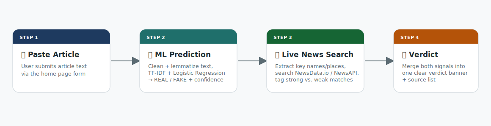
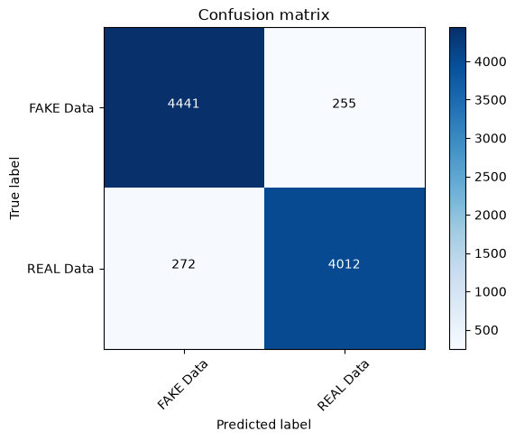

<p align="center">
  
</p>

<p align="center">
  
  
  
  
  
  
</p>

<h1 align="center">Fake News Detection System</h1>

<p align="center">
A Flask web app that checks whether a news article is likely real or fake. It combines a
machine-learning text classifier with a live web search for corroborating news coverage,
so you get both a model prediction <em>and</em> a real-world sanity check in one verdict.
</p>

---

## 🔎 How it works

<p align="center">
  
</p>

1. **Paste an article** into the form on the home page.
2. **ML prediction** — the text is cleaned (stopword removal, lemmatization) and run
   through a TF-IDF vectorizer + Logistic Regression model trained on a labeled
   real/fake news dataset.
3. **Live corroboration check** — the app pulls out the story's key proper nouns
   (people, places, organizations) and searches for recent news coverage that
   actually names them, not just anything sharing a few keywords.
4. **Combined verdict** — the ML prediction and the live search result are merged
   into one of the following:

   | Verdict | Meaning |
   |---|---|
   | 🟢 `LIKELY REAL` | Model says real, and articles specifically about this story were found |
   | 🟡 `WEAKLY CORROBORATED` | Model says real, but only loosely related coverage was found |
   | 🟡 `UNVERIFIED` | Model says real, but no related coverage was found at all |
   | 🟠 `CONFLICTING SIGNALS` | Model says fake, but on-topic articles exist — worth a closer look |
   | 🔴 `LIKELY FAKE` | Model says fake, and no corroborating coverage was found |

5. A **"See Matching Articles"** button lets you inspect the actual sources behind
   the verdict, each labeled *About this story* or *Loosely related*.

---

## 📁 Project structure

```
Fake_News_Detection/
├── app/
│   ├── __init__.py        # App factory (db, login manager, Bootstrap)
│   ├── routes.py          # Routes, news search, verdict logic
│   ├── models.py          # SQLAlchemy User model
│   ├── utils.py           # Text preprocessing + ML prediction
│   └── templates/
│       ├── base.html
│       ├── index.html     # Submission form
│       ├── result.html    # Verdict + prediction + article results
│       └── CSS/style.css
├── assets/                 # README images
├── model/
│   ├── Logistic_Regression.pkl
│   └── tfidf_vectorizer.pkl
├── Dataset/
│   ├── Fake.csv
│   └── True.csv
├── notebooks/
│   └── fake_news_detection.ipynb   # Model training notebook
├── config.py
├── run.py
├── requirements.txt
└── .env
```

---

## ⚙️ Setup

### 1. Install dependencies

```bash
pip install -r requirements.txt
```

### 2. Configure environment variables

Open `.env` and fill in:

```
SECRET_KEY=your-secret-key
NEWS_API_KEY=your-newsapi-org-key       # optional fallback, see note below
NEWSDATA_API_KEY=your-newsdata-io-key   # recommended, real-time results
```

The app checks for live coverage using one of two providers:

- **NewsData.io** (`NEWSDATA_API_KEY`) — used first if set. Its `/latest` endpoint
  only returns articles from the past 48 hours, so it gives genuinely same-day
  results, and its free tier permits production use.
  Get a free key at [newsdata.io](https://newsdata.io).
- **NewsAPI.org** (`NEWS_API_KEY`) — used only as a fallback if no NewsData.io key
  is set. Its free "Developer" plan delays articles by ~24 hours and is restricted
  to localhost, so same-day verification isn't possible on this key alone.
  Get a free key at [newsapi.org](https://newsapi.org).

If neither key is set, the app still returns an ML-only prediction; the corroboration
check is simply skipped.

### 3. Run the app

```bash
python run.py
```

Then open **http://127.0.0.1:5000** in your browser.

---

## 🧠 Model

The classifier was trained on the `Fake.csv` / `True.csv` datasets in `Dataset/`
(see `notebooks/fake_news_detection.ipynb` for the full training process). Text is
cleaned and lemmatized with NLTK, vectorized with TF-IDF, and classified with
Logistic Regression. The trained model and vectorizer are saved as
`model/Logistic_Regression.pkl` and `model/tfidf_vectorizer.pkl`, and loaded by
`app/utils.py` at startup.

**Test set performance** (from the training notebook):

<p align="center">
  
</p>

| Metric | Score |
|---|---|
| Accuracy | **94.13%** |
| Precision (FAKE / REAL) | 0.94 / 0.94 |
| Recall (FAKE / REAL) | 0.95 / 0.94 |
| F1-score (FAKE / REAL) | 0.94 / 0.94 |

---

## ⚠️ Known limitations

- **News coverage, not fact-checking.** The app confirms whether other outlets
  are reporting on the same story — it doesn't independently verify facts within
  an article.
- **Free-tier API limits.** NewsData.io's free tier allows 200 requests/day and
  up to 10 articles per request; NewsAPI's free tier is development-only and
  delayed. For heavier or production traffic, a paid plan is worth considering.
- **English-language coverage only**, and matching quality depends on how well
  a story's key names/places are indexed by the news provider.
